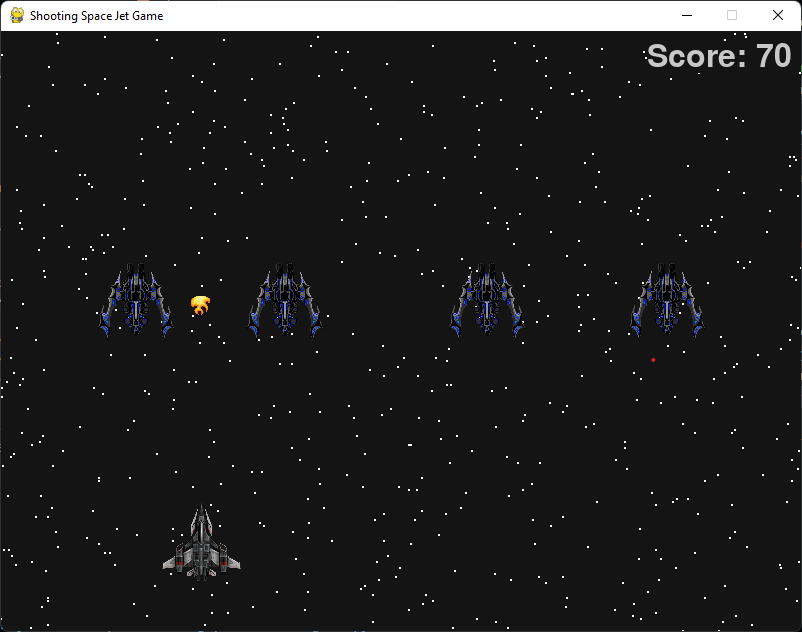

# Shooting Space Jet Game
I created this game for practice purpose. I used pygame to implement the game. It has a player jet which can be moved left or right and can shoot to destroy enemy ships.

## How to run the game ?
Install the msi package available in the release section.

## How to develop ?
Open the main folder (containing setup.py) when developing setup.py. (Game won't execute)

In the res.py file, uncomment the production when the setup.py has to be executed. Or uncomment the development when the development has to be done.

Important: During development, only the main.py in root directory can be used for running. 
The __main__.py is purely used by the setup.py. However, any changes that are to be incorporated has to be made on the files inside of the shootingspacejetgame (inner) folder.

## Screenshots

### Start Screen

### Game Screen

### Score Screen

