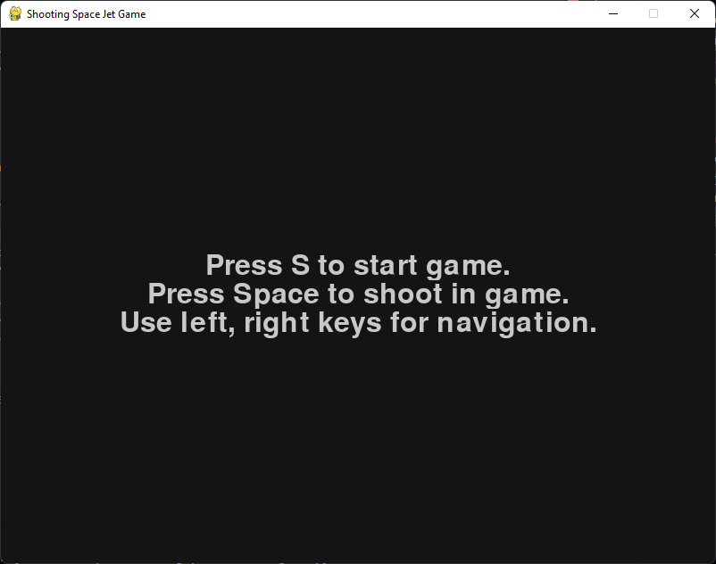
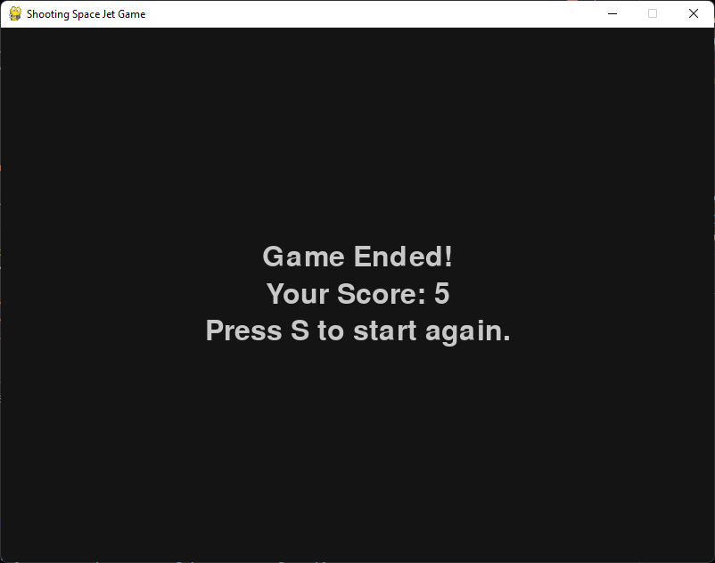

# Shooting Space Jet Game
I created this game for practice purpose. I used pygame to implement the game. It has a player jet which can be moved left or right and can shoot to destroy enemy ships.

## How to run the game ?
1. Download the release package.
2. Extract the zip file to a folder.
3. Install pygame module using *pip install pygame* command.
4. Execute the **game.py** file.
5. The Game shall begin as shown in the screenshots.

## Screenshots

### Start Screen

### Game Screen

### Score Screen

